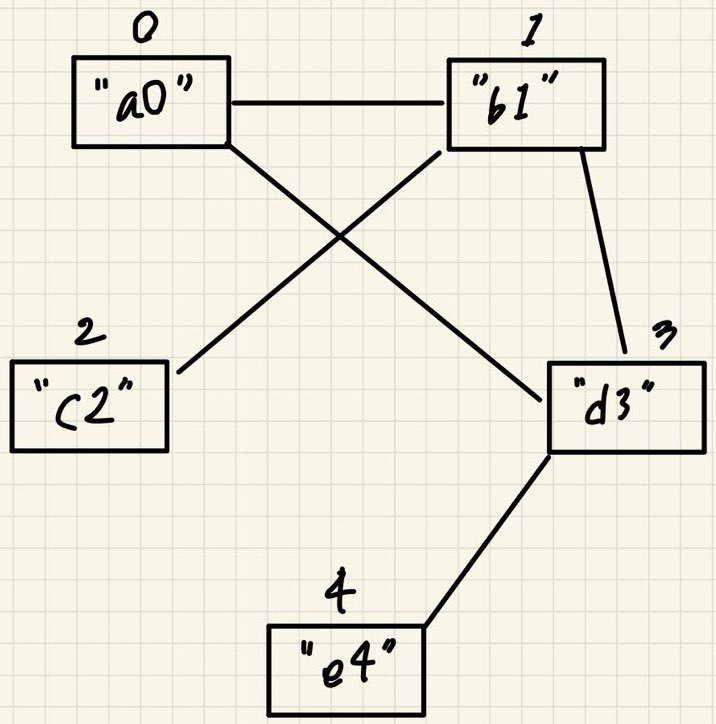

# Undirected Graph(adjacency matrix)

[뒤로 가기](..)

## exercise 00
- allowed functions : malloc, free, printf
- undirected graph를 구현 합니다.
- 아래와 같은 graph.h를 사용 합니다.
	```
	#include <stdbool.h>

	typedef struct	s_graph
	{
		unsigned int	size;
		void			**data;
		bool			**matrix;
	}				t_graph;
	```

### graph_init
- t_graph형 struct를 반환 하는 함수를 작성하세요.
- 반환되는 t_graph는 메모리 할당과 초기화를 거쳐야합니다.
- size는 vertex의 갯수를 나타냅니다.
	```
	t_graph *graph_init(unsigned int size);
	```

### graph_set_data
- graph에 data를 저장하는 함수를 작성하세요.
- graph의 vertex에 data를 저장합니다.
- 성공하면 true, 실패하면 false을 반환 합니다.
	```
	bool	graph_set_data(t_graph *graph, unsigned int vertex, void *data);
	```

### graph_get_data
- graph에 저장된 data를 반환하는 함수를 작성하세요.
- 성공하면 vertex의 data, 실패하면 null pointer를 반환합니다.
	```
	void	*graph_get_data(t_graph *graph, unsigned int vertex);
	```

### graph_set_edge
- graph의 vertex 간 edge의 연결 상태를 변경하는 함수를 작성하세요.
- state의 true는 연결된 상태, false는 연결되지 않은 상태를 의미합니다.
- 성공하면 true, 실패하면 false을 반환 합니다.
- true->true, false->false로의 상태 변화도 성공으로 간주합니다.
	```
	bool	graph_set_edge(t_graph *graph, unsigned int vertex1, unsigned int vertex2, bool state);
	```

### graph_get_edge
- graph의 vertex 간 edge의 연결 상태를 반환하는 함수를 작성하세요.
- 두 vertex가 연결되어 있다면 true, 아니면 false을 반환 합니다.
	```
	bool	graph_get_edge(t_graph *graph, unsigned int vertex1, unsigned int vertex2);
	```

### free_graph
- graph에 있는 요소 전체를 삭제하고 graph의 메모리 할당을 해제하는 함수를 작성하세요.
- data는 free_data를 사용해서 메모리 할당을 해제해야 합니다.
	```
	void free_graph(t_graph *graph, void (*free_data)(void *));
	```

### graph_traverse
- graph를 순회하며 data를 출력하는 함수를 작성하세요.
- 다음과 같은 형식으로 출력합니다.
	- `i번 vertex, data = i_data\n`
	- ex)
		```
		0번 vertex, data = a
		1번 vertex, data = b
		```
- `재귀 함수`를 이용해 `DFS`의 `pre-order` traversal을 구현합니다.
- 순회의 시작은 항상 0번 vertex 입니다.
- 하나의 vertex는 단 1번만 출력해야합니다.
- print_data는 data를 출력하는 함수입니다.(print_data는 마지막에 개행을 포함하고 있습니다.)
	```
	void graph_traverse(t_graph *graph, void (*print_data)(void *));
	```

### make_graph
- 다음과 같은 그래프를 생성하여 반환하는 함수를 작성하세요.
	
- 성공하면 생성된 t_graph의 주소 값을, 실패하면 null pointer를 반환 합니다.
- data들은 free()가 가능한 문자열입니다.
	```
	t_graph	*make_graph(void);
	```


[뒤로 가기](..)
